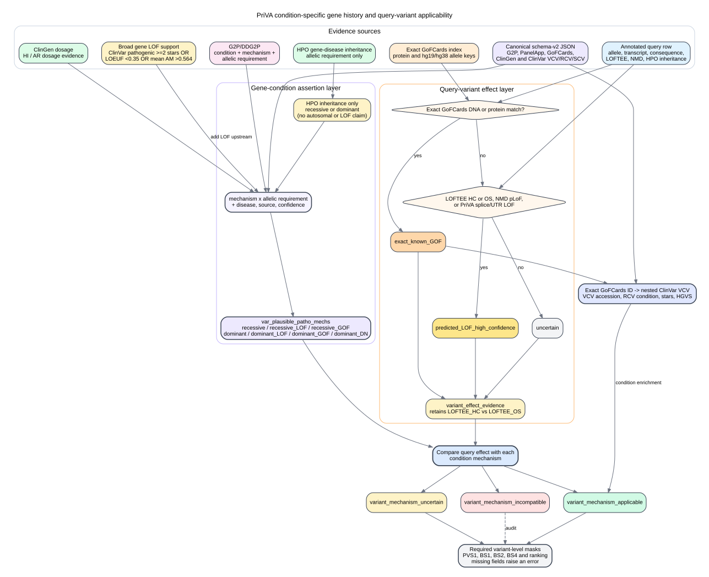

# PriVA Gene Mechanism Hub Decision Flow



The diagram represents the current implementation in
`/paedyl01/disk1/yangyxt/PriVA/scripts/gene_mechanism_hub.py` and its call path
from `/paedyl01/disk1/yangyxt/PriVA/scripts/acmg_criteria_assign.py`.

## Source key

| ID | Runtime source | Current role |
|---|---|---|
| S1 | `/paedyl01/disk1/yangyxt/PriVA/data/hpo/genes_to_phenotype.collapse.tsv.gz` | Collapsed gene-level HPO inheritance terms. |
| S2 | `/paedyl01/disk1/yangyxt/PriVA/data/clingen/gene_dosage_sensitivity.hg19.tsv` | Haploinsufficiency and dosage override used by the inheritance decision. |
| S3 | `/paedyl01/disk1/yangyxt/PriVA/data/loeuf/loeuf_dataset.tsv.gz` | `LOEUF < 0.35` adds broad gene-level LOF support upstream. |
| S4 | `/paedyl01/disk1/yangyxt/PriVA/data/alphamissense/alphamissense_mean_score.tsv` | Gene-average AlphaMissense score `> 0.564` adds broad gene-level LOF support upstream. |
| S5 | `/paedyl01/disk1/yangyxt/PriVA/data/gene_pathogenic_mechanism/prepared/gene_pathogenic_mechanism_evidence.tsv` | Strict high/moderate-confidence G2P/DDG2P LOF assertions and their allelic requirements. |
| S6 | `/paedyl01/disk1/yangyxt/llm_gene_reranker/data/gene_pathogenic_mechanism/prepared/gene_mechanism_curated_assertions.json` | Canonical schema-v2 gene-condition, GoFCards, and exact matched ClinVar VCV evidence. PriVA uses its packaged cache only when this shared file is unavailable. |
| S7 | `/paedyl01/disk1/yangyxt/PriVA/data/gofcards/gofcards_exact_gof_hgvsp.tsv.gz` | Separate exact variant-level GoFCards index used for HGVSp and genomic matching. |
| S8 | PriVA's two-star-or-higher ClinVar pathogenic-variant gene set | Gene membership adds broad gene-level LOF support upstream. |

## Implemented variant-level contract

```text
gene-condition assertion
    mechanism: LOF / GOF / DOMINANT_NEGATIVE / TRIPLOSENSITIVITY / UNRESOLVED
    compact inheritance: recessive / dominant
    disease, source, and confidence

query-variant effect
    exact_known_GOF: exact normalized GoFCards allele or protein match
    predicted_LOF_high_confidence: LOFTEE HC/OS, NMD pLoF, or PriVA splice/UTR LOF
    uncertain: neither of the above

variant-to-condition applicability
    applicable: query effect matches the condition mechanism
    uncertain: inheritance fits but query mechanism is not established
    incompatible: query effect conflicts with the condition mechanism
```

Generic HPO recessive inheritance emits only `recessive`; it does not claim
autosomal inheritance or a LOF mechanism. It is promoted to `recessive_LOF`
only when at least one of these gates is present: a pathogenic ClinVar variant
in the gene with review status of at least two stars, `LOEUF < 0.35`, or gene-
average AlphaMissense score `> 0.564`. Explicit curated DDG2P/G2P and ClinGen
mechanisms remain condition-specific evidence.

`var_plausible_patho_mechs` examples are `recessive`, `recessive_LOF`, `recessive_GOF`,
`dominant`, `dominant_LOF`, `dominant_GOF`, and `dominant_DN`. Source-specific
allelic wording remains available in `variant_mechanism_applicability_detail`
for audit but is not repeated in the compact tags. Mechanisms classified as
incompatible with the query variant are excluded from this column.

The primary dataframe fields are:

```text
var_plausible_patho_mechs
gene_lof_evidence
variant_effect
variant_effect_evidence
variant_effect_conflict
variant_mechanism_applicable
variant_mechanism_uncertain
variant_mechanism_incompatible
variant_mechanism_applicability_detail
clinvar_vcv_accessions
clinvar_rcv_conditions
clinvar_vcv_max_review_stars
clinvar_vcv_hgvs
```

The former `gene_mech_inher_history` output is now
`var_plausible_patho_mechs` and is produced by the same in-place annotation
function. PVS1, BS1, BS2, BS4, and ranking require the variant-level fields.
Missing fields raise an error rather than activating a gene-level or raw-
annotation fallback.

## LOFTEE HC and OS

LOFTEE `HC` and `OS` are both treated as high-confidence predicted LOF. `OS`
means "other splice" and covers predicted disruptions in extended donor or
acceptor regions as well as newly created donor sites. The original LOFTEE
category remains in `variant_effect_evidence`, so OS is not collapsed into HC.

## ClinVar hierarchy and review-tier audit

The exact allele join is made at the VCV level because VCV is ClinVar's stable
variation-centric record. Each matched VCV retains its condition-specific RCV
records as `condition_assertions`; linked submission-level SCV observations
remain nested under the corresponding RCV. The review threshold is applied to
the RCV aggregate classification, not to the VCV container.

For an exact query GoFCards match, PriVA now joins the row's GoFCards variant or
accession ID to the nested schema-v2 `ClinVar_VCV.match` records. This adds the
VCV accession, RCV condition names, maximum retained review stars, and ClinVar
HGVS expressions. ClinVar observed zygosity remains evidence only and is not
converted into a causal allelic requirement.

The 2026-07-23 full-release audit found:

| Review coverage among exact, gene-concordant GoFCards matches | VCV count |
|---|---:|
| Maximum RCV review level is 0 stars | 207 |
| Maximum RCV review level is 1 star | 626 |
| Maximum RCV review level is 2 stars | 445 |
| Maximum RCV review level is 3 stars | 80 |
| Total with at least one RCV at 2 or more stars | 525 |

The two-star-or-higher canonical subset covers 216 distinct genes. Lower-review
matched VCVs occur in 330 genes; 208 of those genes have no matched VCV reaching
two stars. Review stars measure review quality and consensus, not whether the
classification itself is pathogenic or benign.

Audit summary:

`/paedyl01/disk1/yangyxt/llm_gene_reranker/data/gene_pathogenic_mechanism/prepared/clinvar_gofcards_review_tier_summary.json`

All matched RCV review tiers:

`/paedyl01/disk1/yangyxt/llm_gene_reranker/data/gene_pathogenic_mechanism/prepared/clinvar_gofcards_all_review_tiers.tsv`
